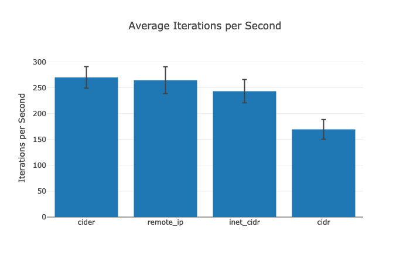
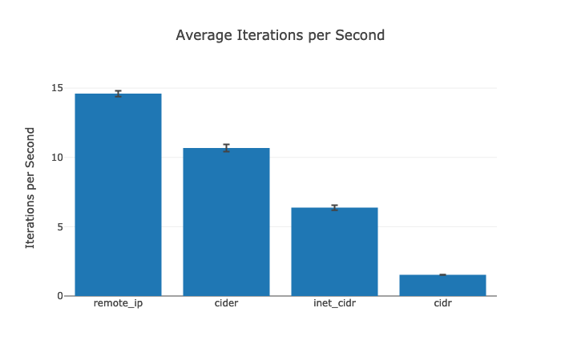

# Benchmarks

For the purposes of remote\_ip, we need a library to (1) parse strings from CIDR notation into a usable representation for (2) checking if an IP falls within a certain block. At the time of this writing, there are a couple [CIDR libraries](https://hex.pm/packages?search=cidr) available on Hex.pm:

* [inet\_cidr](https://hex.pm/packages/inet_cidr)
* [erl\_cidr](https://hex.pm/packages/erl_cidr) (an Erlang wrapper around inet\_cidr)
* [cidr](https://hex.pm/packages/cidr)
* [cider](https://hex.pm/packages/cider)

Due to the shortcomings of these libraries, remote\_ip rolls its own `RemoteIp.Block` module. This app serves as a testing ground for comparing remote\_ip's implementation against the others to validate whether it's actually an improvement.

## Results

Using [benchee](https://github.com/bencheeorg/benchee), we run a block of code repeatedly for a static amount of time (after a warmup) and count how many iterations we got through. Thus, in the _iterations per second_ results charted below, bigger is better: it means we performed more operations in a given amount of time.

### Parsing CIDRs

This benchmark generates 1,000 random CIDR strings and measures the time it takes to parse them all with each different library.



```console
$ mix run parse.exs
Randomizing with seed 294598

Operating System: macOS
CPU Information: Intel(R) Core(TM) i5-1038NG7 CPU @ 2.00GHz
Number of Available Cores: 8
Available memory: 16 GB
Elixir 1.11.4
Erlang 23.2.7

Benchmark suite executing with the following configuration:
warmup: 2 s
time: 5 s
memory time: 0 ns
parallel: 1
inputs: none specified
Estimated total run time: 28 s

Benchmarking cider...
Benchmarking cidr...
Benchmarking inet_cidr...
Benchmarking remote_ip...
Generated tmp/parse.html
Generated tmp/parse_cider.html
Generated tmp/parse_cidr.html
Generated tmp/parse_comparison.html
Generated tmp/parse_inet_cidr.html
Generated tmp/parse_remote_ip.html

Name                ips        average  deviation         median         99th %
cider            269.94        3.70 ms     ±7.72%        3.61 ms        4.74 ms
remote_ip        264.49        3.78 ms     ±9.78%        3.70 ms        5.22 ms
inet_cidr        243.27        4.11 ms     ±9.25%        4.08 ms        5.51 ms
cidr             169.52        5.90 ms    ±11.24%        5.77 ms        7.79 ms

Comparison:
cider            269.94
remote_ip        264.49 - 1.02x slower +0.0763 ms
inet_cidr        243.27 - 1.11x slower +0.41 ms
cidr             169.52 - 1.59x slower +2.19 ms
```

### Checking IPs

This benchmark generates 1,000 random CIDRs and 1,000 randoms IPs, then uses each library to check every combination (1,000 CIDRs x 1,000 IPs = 1,000,000 checks per iteration).

To avoid conflating the performance results, we perform the CIDR parsing ahead of time and don't measure it in the actual benchmark. Similarly, both remote\_ip and cider must encodes the incoming IPs as integers, so we perform that step outside of the measurement as well.



```console
$ mix run check.exs
Randomizing with seed 570890

Operating System: macOS
CPU Information: Intel(R) Core(TM) i5-1038NG7 CPU @ 2.00GHz
Number of Available Cores: 8
Available memory: 16 GB
Elixir 1.11.4
Erlang 23.2.7

Benchmark suite executing with the following configuration:
warmup: 2 s
time: 5 s
memory time: 0 ns
parallel: 1
inputs: none specified
Estimated total run time: 28 s

Benchmarking cider...
Benchmarking cidr...
Benchmarking inet_cidr...
Benchmarking remote_ip...
Generated tmp/check.html
Generated tmp/check_cider.html
Generated tmp/check_cidr.html
Generated tmp/check_comparison.html
Generated tmp/check_inet_cidr.html
Generated tmp/check_remote_ip.html

Name                ips        average  deviation         median         99th %
remote_ip         14.60       68.50 ms     ±1.43%       68.65 ms       70.67 ms
cider             10.68       93.66 ms     ±2.41%       93.86 ms       97.84 ms
inet_cidr          6.37      156.88 ms     ±2.89%      157.15 ms      165.46 ms
cidr               1.53      652.73 ms     ±0.91%      652.71 ms      661.14 ms

Comparison:
remote_ip         14.60
cider             10.68 - 1.37x slower +25.16 ms
inet_cidr          6.37 - 2.29x slower +88.38 ms
cidr               1.53 - 9.53x slower +584.23 ms
```
